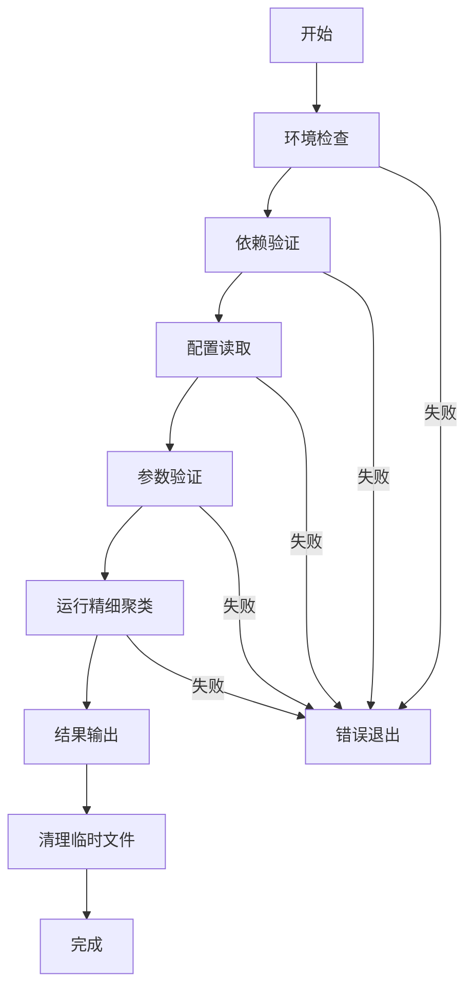

# AF3精细聚类运行脚本使用指南

## 概述

本目录包含了AF3精细聚类的完整运行脚本，包括：
- `AF3_Cluster_fine_v1.py` - 精细聚类主脚本
- `run_fine_clustering.sh` - Linux/macOS运行脚本
- `run_fine_clustering.bat` - Windows运行脚本
- `config_fine_clustering.txt` - 配置文件模板

## 快速开始

### 1. 准备环境

确保已安装以下依赖：

```bash
# Python包
pip install numpy pandas scipy scikit-learn matplotlib hdbscan biopython psutil

# 外部工具（可选，但推荐）
# Foldseek: https://github.com/steineggerlab/foldseek
# US-align: https://github.com/pylelab/USalign

# 外部工具路径已在shell脚本中硬编码，如需修改请编辑run_fine_clustering.sh文件
```

### 2. 配置参数

编辑 `config_fine_clustering.txt` 文件：

```bash
# 粗聚类结果文件路径（必需）
COARSE_RESULTS_FILE=af3_coarse_clustering_results/coarse_clustering_results.pkl

# 原始结构文件目录（必需）
PDB_DIR=./original_structures

# 粗聚类结构文件夹路径（可选，如果存在则优先使用）
COARSE_CLUSTERS_DIR=af3_coarse_clustering_results/coarse_clusters

# 输出目录（可选，默认为 af3_fine_clustering_results）
OUTPUT_DIR=af3_fine_clustering_results

# 并行处理线程数（可选，默认为自动检测）
N_JOBS=4

# 注意：外部工具路径已在shell脚本中硬编码，如需修改请编辑run_fine_clustering.sh文件
```

### 3. 运行脚本

#### Linux/macOS:
```bash
# 给脚本执行权限
chmod +x run_fine_clustering.sh

# 运行精细聚类
./run_fine_clustering.sh

# 使用自定义配置
./run_fine_clustering.sh -c my_config.txt

# 仅检查配置（不运行）
./run_fine_clustering.sh -d

# 详细输出模式
./run_fine_clustering.sh -v
```

#### Windows:
```cmd
# 运行精细聚类
run_fine_clustering.bat

# 使用自定义配置
run_fine_clustering.bat -c my_config.txt

# 仅检查配置（不运行）
run_fine_clustering.bat -d

# 详细输出模式
run_fine_clustering.bat -v
```

## 脚本功能详解

### 运行脚本功能

#### 1. 环境检查
- ✅ Python环境检查
- ✅ 依赖包检查（numpy, pandas, scipy, sklearn, matplotlib, hdbscan, biopython, psutil）
- ✅ 外部工具检查（Foldseek, US-align）

#### 2. 配置验证
- ✅ 配置文件读取和解析
- ✅ 必需文件和目录存在性检查
- ✅ 参数有效性验证

#### 3. 运行管理
- ✅ 自动配置生成
- ✅ 日志记录
- ✅ 错误处理
- ✅ 临时文件清理

#### 4. 命令行选项

| 选项 | 说明 | 示例 |
|------|------|------|
| `-h, --help` | 显示帮助信息 | `./run_fine_clustering.sh -h` |
| `-c, --config FILE` | 指定配置文件 | `./run_fine_clustering.sh -c my_config.txt` |
| `-d, --dry-run` | 仅检查配置，不运行 | `./run_fine_clustering.sh -d` |
| `-v, --verbose` | 详细输出模式 | `./run_fine_clustering.sh -v` |
| `--clean` | 清理临时文件 | `./run_fine_clustering.sh --clean` |

### 配置文件格式

配置文件使用简单的键值对格式：

```bash
# 注释以#开头
COARSE_RESULTS_FILE=path/to/coarse_results.pkl
PDB_DIR=path/to/original_structures
COARSE_CLUSTERS_DIR=path/to/coarse_clusters
OUTPUT_DIR=path/to/output
N_JOBS=4
```

#### 配置项说明

| 配置项 | 必需 | 说明 | 默认值 |
|--------|------|------|--------|
| `COARSE_RESULTS_FILE` | ✅ | 粗聚类结果文件路径 | 无 |
| `PDB_DIR` | ✅ | 原始结构文件目录 | 无 |
| `COARSE_CLUSTERS_DIR` | ❌ | 粗聚类结构文件夹路径 | 无 |
| `OUTPUT_DIR` | ❌ | 输出目录 | `af3_fine_clustering_results` |
| `N_JOBS` | ❌ | 并行处理线程数 | 自动检测 |


## 外部工具路径配置

### 修改外部工具路径

外部工具路径已硬编码在shell脚本中，如需修改请编辑 `run_fine_clustering.sh` 文件：

```bash
# 在脚本开头找到以下行并修改路径
FOLDSEEK_CMD="/mnt/share/public/foldseek/bin/foldseek"
USALIGN_CMD="/mnt/share/public/USalign"
```

### 查找工具路径

如果不知道工具的安装位置，可以使用以下命令查找：

```bash
# 查找Foldseek
which foldseek
find / -name "foldseek" -type f 2>/dev/null

# 查找US-align
which US-align
find / -name "US-align" -type f 2>/dev/null
```

## 工作流程

### 1. 文件查找策略

精细聚类脚本采用三级文件查找策略：

```
优先级1: 粗聚类结构文件夹
    ├── cluster_0/
    ├── cluster_1/
    ├── ...
    └── noise_cluster/

优先级2: 原始PDB目录
    ├── structure_001.pdb
    ├── structure_002.cif
    └── ...

优先级3: 文件名作为完整路径
```

### 2. 运行流程



### 3. 输出文件

运行完成后，会在输出目录中生成以下文件：

```
af3_fine_clustering_results/
├── fine_clustering_results.pkl          # 精细聚类结果
├── fine_clustering_results.csv          # 聚类结果CSV
├── fine_clusters/                       # 精细聚类结构文件夹
│   ├── fine_cluster_0/
│   ├── fine_cluster_1/
│   └── ...
└── visualizations/                      # 可视化结果
    ├── fine_clustering_overview.png
    ├── fine_cluster_distribution.png
    ├── cluster_size_distribution.png
    ├── hierarchical_structure.png
    └── cluster_radial_tree.png
```

## 故障排除

### 常见问题

#### 1. Python环境问题
```bash
# 错误: Python未安装或不在PATH中
# 解决: 安装Python并添加到PATH
python --version
```

#### 2. 依赖包缺失
```bash
# 错误: 缺少Python包
# 解决: 安装缺失的包
pip install numpy pandas scipy scikit-learn matplotlib hdbscan biopython psutil
```

#### 3. 配置文件问题
```bash
# 错误: 配置文件不存在或格式错误
# 解决: 检查配置文件路径和格式
cat config_fine_clustering.txt
```

#### 4. 文件路径问题
```bash
# 错误: 粗聚类结果文件或PDB目录不存在
# 解决: 检查文件路径是否正确
ls -la af3_coarse_clustering_results/
ls -la original_structures/
```

#### 5. 外部工具问题
```bash
# 警告: Foldseek或US-align未安装
# 解决: 安装外部工具或使用备用方法
foldseek --version
US-align --help
```

### 日志文件

脚本运行时会生成详细的日志文件 `fine_clustering_run.log`，包含：
- 环境检查结果
- 配置验证信息
- 运行过程日志
- 错误和警告信息

### 调试模式

使用详细输出模式查看完整的运行信息：

```bash
# Linux/macOS
./run_fine_clustering.sh -v

# Windows
run_fine_clustering.bat -v
```

## 高级用法

### 1. 自定义配置

创建自定义配置文件：

```bash
# 创建自定义配置
cat > my_config.txt << EOF
COARSE_RESULTS_FILE=my_coarse_results.pkl
PDB_DIR=./my_structures
COARSE_CLUSTERS_DIR=./my_coarse_clusters
OUTPUT_DIR=my_fine_results
N_JOBS=8
EOF

# 使用自定义配置运行
./run_fine_clustering.sh -c my_config.txt
```

### 2. 批量处理

创建批量处理脚本：

```bash
#!/bin/bash
# batch_fine_clustering.sh

for config in configs/*.txt; do
    echo "处理配置: $config"
    ./run_fine_clustering.sh -c "$config"
    if [ $? -eq 0 ]; then
        echo "成功: $config"
    else
        echo "失败: $config"
    fi
done
```

### 3. 自动化工作流

结合粗聚类和精细聚类的完整工作流：

```bash
#!/bin/bash
# complete_clustering_workflow.sh

# 1. 运行粗聚类
echo "步骤1: 运行粗聚类..."
python AF3_Cluster_Corse_v1.py

# 2. 检查粗聚类结果
if [ ! -f "af3_coarse_clustering_results/coarse_clustering_results.pkl" ]; then
    echo "错误: 粗聚类失败"
    exit 1
fi

# 3. 运行精细聚类
echo "步骤2: 运行精细聚类..."
./run_fine_clustering.sh

echo "完整聚类工作流完成"
```

## 性能优化

### 1. 并行处理
- 设置合适的 `N_JOBS` 参数
- 根据CPU核心数调整
- 避免设置过高导致内存不足

### 2. 内存管理
- 监控内存使用情况
- 对于大数据集，考虑分批处理
- 及时清理临时文件

### 3. 存储优化
- 使用SSD存储提高I/O性能
- 定期清理不需要的中间文件
- 压缩大型结果文件

## 版本信息

- 脚本版本: 1.0
- 支持平台: Linux, macOS, Windows
- Python版本要求: 3.7+
- 最后更新: 2024年

## 技术支持

如遇到问题，请：
1. 查看日志文件 `fine_clustering_run.log`
2. 使用 `-v` 参数获取详细输出
3. 检查配置文件和路径设置
4. 确认所有依赖已正确安装
